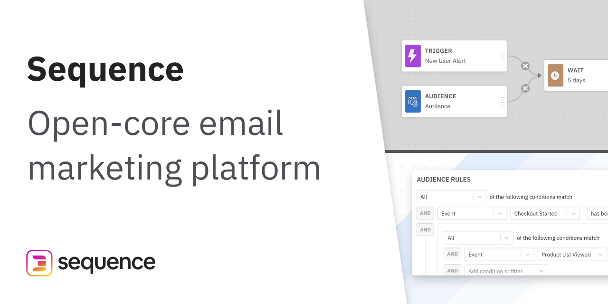

# Sequence


An open-core email marketing automation tool built with Next.js and Node.js.

## Quick Start with Docker (Recommended)

1. Clone the repository:
```bash
git clone https://github.com/sequence-so/sequence
cd sequence
```

2. Configure Environment:
   - For development:
     ```bash
     # In packages/ui/
     cp .env.development .env
     
     # In packages/api/
     cp .env.development .env
     
     # Start the development environment
     docker compose up --build
     ```
   
   - For production:
     ```bash
     # In packages/ui/
     cp .env.production .env
     
     # In packages/api/
     cp .env.production .env
     
     # Start the production environment
     NODE_ENV=production docker compose up --build
     ```

The application will be available at:
- UI: http://localhost:8000
- API: http://localhost:3000 (internal only)

## Environment Configuration

### Development vs Production

#### Development Mode
- Uses `.env.development` settings
- API requests are proxied through Next.js
- Debug logging enabled
- Hot reloading enabled
- Start with: `docker compose up --build`

#### Production Mode
- Uses `.env.production` settings
- API requests are proxied through Next.js
- Optimized builds and disabled development features
- Start with: `NODE_ENV=production docker compose up --build`

### Environment Files
The project uses multiple environment files:
- `.env.development` - Development settings
- `.env.production` - Production settings
- `.env` - Active environment (must be copied from either development or production)

Important: Always copy the appropriate .env file before building:
```bash
# For development
cp .env.development .env

# For production
cp .env.production .env
```

Key environment variables:
```bash
# Development (.env.development)
NEXT_PUBLIC_API_URL=/api           # Public API endpoint (proxied)
NEXT_PRIVATE_API_URL=http://api:3000  # Internal container communication
DEV_UI_URL=http://localhost:8000   # Development UI URL

# Production (.env.production)
NEXT_PUBLIC_API_URL=/api           # Public API endpoint (proxied)
NEXT_PRIVATE_API_URL=http://api:3000  # Internal container communication
```

### API Proxy Configuration
The application uses a Next.js API proxy to handle all API communications. This setup:
- Eliminates CORS issues
- Simplifies environment configuration
- Improves security by not exposing the API directly
- Maintains authentication flow

The proxy is configured in:
- `pages/api/graphql.ts` - Main GraphQL proxy endpoint
- `next.config.js` - URL rewrite rules
- `services/apollo.ts` - Apollo client configuration

## Manual Setup

### Requirements
* Node.js ≥15.0.0
* PostgreSQL ≥11
* Redis

### Environment Setup

1. Install dependencies:
```bash
yarn install
yarn bootstrap
```

2. Configure environment as described in Environment Configuration section

### Development

Start the development servers:
```bash
yarn dev
```

### Production

For production deployment:
```bash
# Set production environment variables
export NEXT_PUBLIC_API_URL=https://your-domain.com
export NODE_ENV=production

# Build and start containers
docker compose up
```

## Environment Variables

### UI Configuration
- `PORT`: UI server port (default: 8000)
- `NEXT_PUBLIC_API_URL`: Public API URL (default: http://localhost:3000)
- `NEXT_PRIVATE_API_URL`: Internal API URL for container communication (default: http://api:3000)
- `NODE_ENV`: Environment mode ('development' or 'production')

### API Configuration
- `PORT`: API server port (default: 3000)
- `DB_USERNAME`: PostgreSQL username
- `DB_PASSWORD`: PostgreSQL password
- `DB_DATABASE`: PostgreSQL database name
- `DB_HOST`: PostgreSQL host
- `REDIS_URL`: Redis connection URL

## Support
For support, please reach out to `support@sequence.so`.

## Features
.gif)
- **Segment your customers** by Events, User Attributes, or Event Attributes via our Audience Builder
- **Create multi-step Campaigns** spanning multiple touchpoints using our drag-and-drop UI
- **Send targeted emails** to your Audiences
- **Search and filter through customer data** from multiple sources (Segment, API, SDK, with Intercom and CSV coming soon)
- **API first** with a GraphQL API and HTTP API

## **What's Next**

[Read about importing data to begin using Sequence.](https://sequence.gitbook.io/sequence/node-sdk/node-sdk)

[Read our Documentation here.](https://sequence.gitbook.io/sequence/node-sdk/node-sdk)

## Building Sequence

**Requirements**

* Node ≥15.0.0
* Postgres ≥11

**Recommended**

* A Sendgrid API Key to send emails
* Read `/packages/api/.env.example` to configure your environment variables.

```text
git clone https://github.com/sequence-so/sequence
cd sequence
yarn bootstrap
./build/copy_env
yarn dev
```

### Today

Sequence is an open core email marketing automation tool. It allows you to send a one-off email to a list of people. 

### The Vision

Sequence will be the bridge between data teams and data-driven marketers, allowing marketers to unlock the full potential of their customer data. 

### Problem

Marketing is more complex than ever, and with so much customer data being generated, you would think that launching highly targeted messaging campaigns is a breeze. However, we find that that's not the case:

1. **Marketing data is siloed and opaque**. For many marketers, creating highly targeted multi-channel campaigns is more difficult than ever. Simply put: there's a lot of data but the right people don't have access to it. Today, marketers have to constantly ask for email lists from their data team. Marketers should be able to use all available data to build highly target campaigns. 
2. **Marketing software has terrible reporting.** Understanding critical questions like, "how many customers in a campaign actually purchased the product?" requires end to end analytics that combines marketing, product, and sales data. However, marketing tools aren't meant for answering complex questions across multiple data "objects." We believe that best in class marketing tools will allow marketers to ask these complex questions natively in one tool.
3. **Data exploration is difficult for non-SQL users.** Even when the data is combined in a warehouse and exposed via a BI tool, most marketers don't know SQL. This makes it difficult to explore schemas and ask questions via BI tools. Marketers should be able to create customer segments and analyze campaign success without knowing SQL. 
4. **Business intelligence dashboards for marketing are too high-level and don't inform campaign strategy.** Even when marketers have access to BI dashboards to inform their marketing strategy, dashboards typically answer executive level questions and don't inform day to day decision making because the queries aren't granular enough to target individual campaigns or specific segments. Marketing dashboards should be quick to make, easy to maintain, and provide insights into day to day campaign performance. 

### Solution

Our vision is to create a marketing automation software that puts data teams and business intelligence at its core:

1. **Allow for native access to your database\(s\).** Engineers should be able to connect to their data warehouse via a native connection in our product, eliminating the need for data pipelines and synchronization across multiple tools. 
2. **Expose the right information and catalog the schema.** Data teams can catalog queries and important customer attributes in a simple interface, which will standardize query definitions, eliminate customer lists in CSVs, and improve collaboration between marketing and data.
3. **Native integration with BI tools.** For teams that already have a BI tool, we will integrate with their existing BI tool's query library so marketers can see customer attributes and segments as quickly as data scientists can write SQL. 
4. **Create A/B tests and track campaign performance.** Setup A/B tests for your campaigns and measure impact on growth and revenue in a statistically meaningful way. 

### Why Open Core?

Our vision is possible only with direct integration into our customers' data warehouse. We believe that the next generation of SaaS marketing products will operate within private clouds, rather than requiring expensive ETL for both incoming and outgoing data. This means that the code should be auditable by companies to provide trust in our software. 

It's reminiscent to days before Salesforce—when companies' owned their entire stack within their own walls, except today the servers are in the cloud and separated from the world by firewalls. 

Please reach out if any errors occur at `support@sequence.so`.
