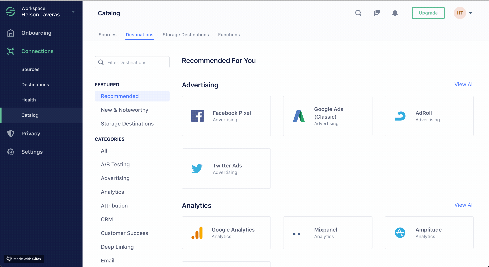

# Importing Data

### Importing Data

There are three ways you can import data into Sequence at the moment:

* Via a Segment Webhook connector \(for a continuous data feed, no historical import\)
* Via our API \(for either a continuous data feed or historical, bulk import\)
* Via our NodeJS SDK
* Via CSV \(coming soon\)
* Via Intercom \(coming soon\)

### Segment Connector

Note: these instructions are available via our onboarding flow, accessible via `/onboarding`. The instructions are best followed that way. 

In this setup, we'll create a pipeline from your Segment data to Sequence. First, visit the **Connections &gt; Source** and select the source you'd like to send data from. 

Then, click **Add Destination.** Select **Custom Webhook \(Raw Data\) &gt; Configure Webhook** and give it a name \(Sequence\). 

Configure your Webhook URL. This is the URL you're running Sequence on followed by `/api/segment`. Next, you'll need your auth token. This is available at `http://{sequence_ui}/onboarding/segment`.

Fill in the custom headers field with `Authorization:Token`.

**Last, make sure the webhook is turned on!**

Back in the Sequence dashboard, click "Next" at the bottom of the Segment integration page. You'll see this page:

Once Segment sends over data, you'll see this:

### API Import

You can also import data via our HTTP API. 





